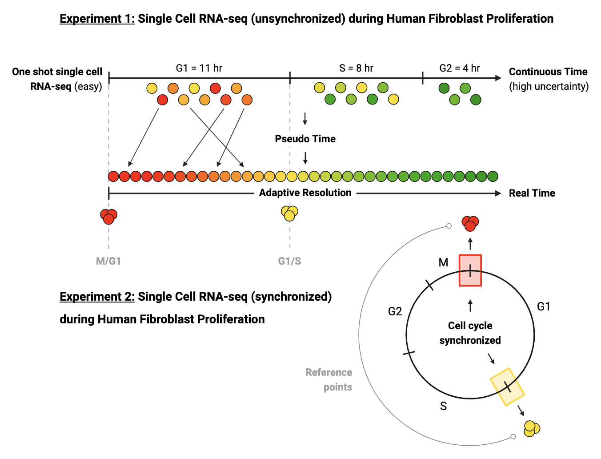

# Cell Cycle Analysis

This repository collects code, notebooks, and workflow definitions used to analyze single‑cell long‑read RNA‑seq measurements from BJ fibroblasts synchronized across the cell cycle. It serves both as a record of analysis steps and as a starting point for reproducing and extending the study.

## Repository Structure
- `notebooks/` – exploratory Jupyter notebooks and small utilities demonstrating analysis steps and figures.
- `pipelines/` – reproducible processing workflows such as Velocyto, DeepCycle, TrajectoryNet, and single‑cell processing wrappers.
- `resources/` – reference gene sets, pathway annotations, and other auxiliary data.
- `figures/` – images and diagrams referenced in documentation and publications.

Each subdirectory includes a README with further details on its contents and usage.
