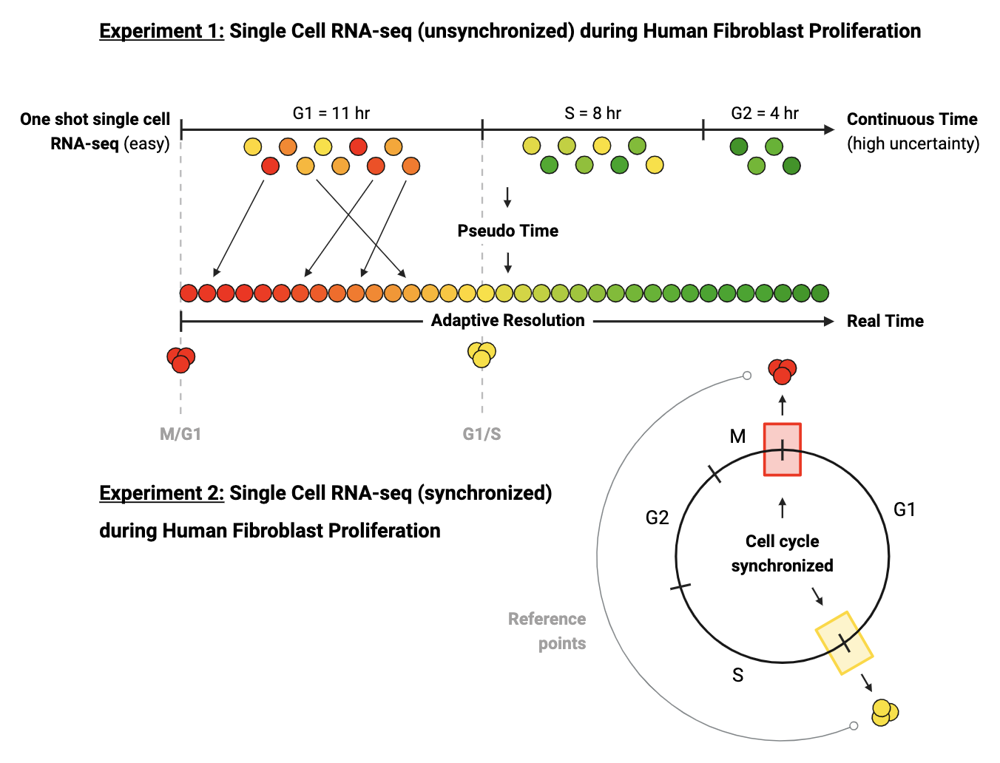

# Cell Cycle Analysis

This repository collects code, notebooks, and workflow definitions used to analyze single‑cell long‑read RNA‑seq measurements from BJ fibroblasts synchronized across the cell cycle. It serves both as a record of analysis steps and as a starting point for reproducing and extending the study.



## Repository Structure
- `notebooks/` – exploratory Jupyter notebooks and small utilities demonstrating analysis steps and figures.
- `pipelines/` – reproducible processing workflows such as Velocyto, DeepCycle, TrajectoryNet, and single‑cell processing wrappers.
- `resources/` – reference gene sets, pathway annotations, and other auxiliary data.
- `figures/` – images and diagrams referenced in documentation and publications.

Each subdirectory includes a README with further details on its contents and usage.

## Getting Started

Clone the repository and create a fresh Python environment with Jupyter installed:

```bash
git clone https://github.com/example/cell_cycle.git
cd cell_cycle
pip install jupyterlab
```

Most notebooks expect processed count matrices generated by the workflows under `pipelines/`. Adjust data paths within each notebook to match your environment before execution.

## Contributing

Issues and pull requests are welcome. Please open an issue describing bugs or suggesting improvements so that analyses remain reproducible.

